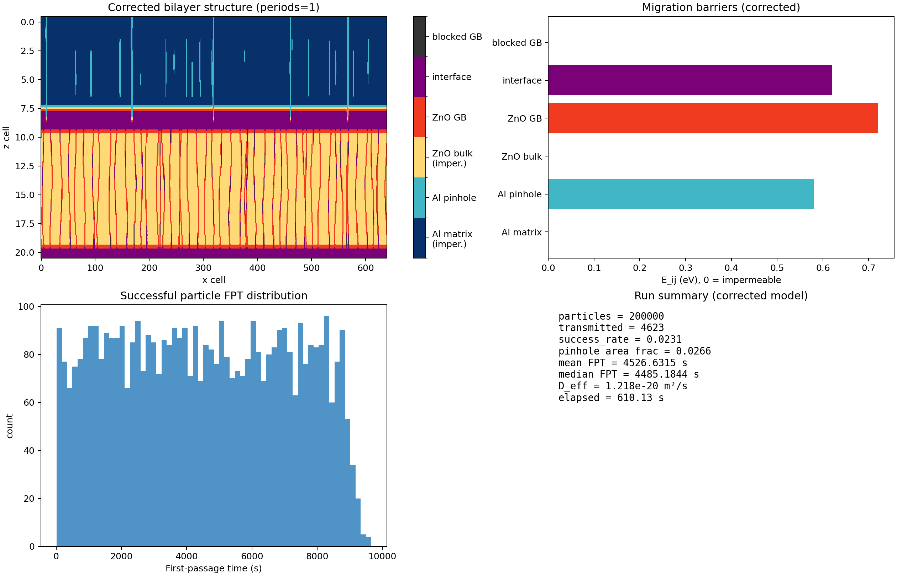
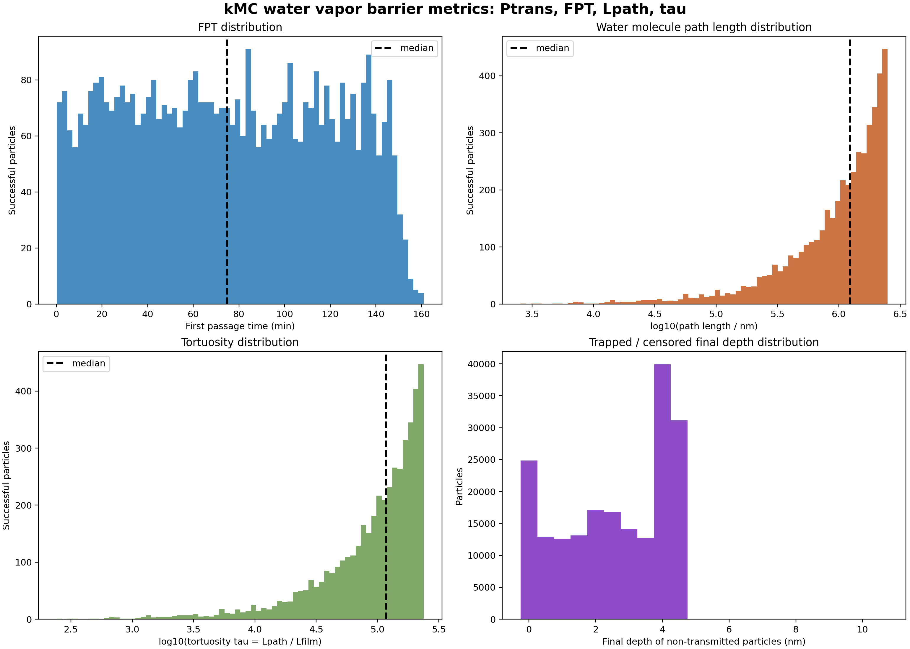
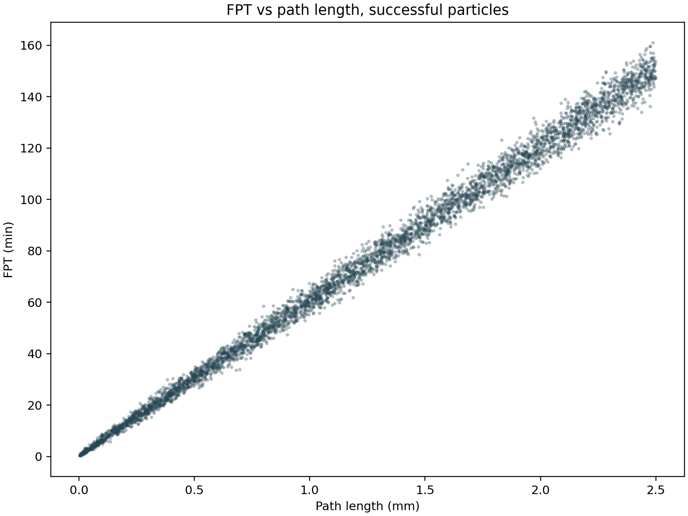

# Al2O3/ZnO 双层单周期 kMC 计算报告

## 结构定义

本报告只讨论一个双层周期：

```text
湿侧
|
Al2O3 4.5 nm: 致密非晶 + 稀疏针孔/非贯通自由体积缺陷
|
Al2O3/ZnO interface: 横向搜索层
|
ZnO 6.0 nm: 单层截断纤锌矿晶粒，晶界贯穿 ZnO 厚度
|
干侧
```

该结构对应 TEM 中 5 nm 量级 Al2O3/ZnO 纳米叠层的物理图像：ZnO 层厚度小于或接近单个 ZnO 纳米晶粒尺度，因此 ZnO 不按厚膜式多层晶粒堆叠计算，而按被上下界面截断的单层多晶纤锌矿层计算。ZnO 晶粒本体不可渗透，水汽主要沿晶界、界面错配区域和局部缺陷迁移。

## 传输路径

水分子的计算路径定义为：

```text
表面扩散找 Al2O3 针孔
→ 穿过 Al2O3 针孔
→ 在 Al2O3/ZnO 界面横向搜索 ZnO 晶界入口
→ 沿 ZnO 晶界穿过 6 nm ZnO
→ 到达干侧
```

若粒子没有找到 Al2O3 针孔、没有从界面进入 ZnO 晶界，或进入被阻断的晶界段，则在有限事件数或有限时间内记为未穿透。

## 几何与物理假设

- Al2O3 厚度 = 4.5 nm
- ZnO 厚度 = 6.0 nm
- 总厚度 = 10.5 nm
- 网格分辨率 = 0.5 nm
- 横向宽度 = 320 nm，周期边界
- 粒子数 = 200000
- 最大事件数 = 5000000 / particle
- 温度 = 311.15 K
- 相对湿度 = 0.90
- Al2O3 基体 = 不可渗透
- ZnO 晶粒本体 = 不可渗透
- Al2O3 针孔 = 1-2 nm，间距 50-80 nm
- Al2O3 非贯通自由体积缺陷 = 局部缺陷，不计为表面贯通入口
- ZnO 晶粒模型 = 单层截断横向纤锌矿晶粒
- ZnO 晶界 = 贯穿 ZnO 厚度，但带轻微倾斜/弯曲
- ZnO 晶界阻断比例 = 0.20

## 迁移能垒

- Al2O3 表面扩散 = 0.45 eV
- Al2O3 针孔迁移 = 0.58 eV
- Al2O3/ZnO 界面迁移 = 0.62 eV
- ZnO 晶界迁移 = 0.72 eV
- Al2O3 致密基体 = 不可渗透
- ZnO 晶粒本体 = 不可渗透
- 阻断晶界 = 不可渗透

## 核心计算量

本次输出以下指标：

- Ptrans(t)：给定模拟窗口内的穿透概率。
- FPT：首次通过时间分布。
- Lpath：水分子路径长度。
- tau = Lpath / Lfilm：曲折度。
- D_eff = L_total^2 / (2 * mean_FPT)：有效扩散系数。
- WVTR = D_eff * delta_C / L_total：水汽透过率。
- 未穿透粒子的最终位置分布：用于判断粒子主要滞留在 Al2O3、界面还是 ZnO。

## 计算结果

- Ptrans = 0.023115
- 穿透粒子数 = 4623 / 200000
- FPT mean = 4526.63 s
- FPT median = 4485.18 s
- FPT p10 / p90 = 950.76 / 8175.06 s
- Lpath mean = 1.2465 mm
- Lpath median = 1.2316 mm
- tau mean = 1.187e5
- tau median = 1.173e5
- D_eff, mean-FPT = 1.218e-20 m2/s
- D_eff, median-FPT = 1.229e-20 m2/s
- WVTR, ideal vapor delta_c = 4.164e-06 g m^-2 day^-1
- WVTR, literature sorbed C1 = 6.784e-04 g m^-2 day^-1
- 未穿透粒子数 = 195377
- 未穿透粒子最终深度 mean = 2.570 nm
- 未穿透粒子最终深度 median = 3.000 nm

## 结果解释

本次模型中，ZnO 层不是多层晶粒堆叠，而是一个 6 nm 厚的单层截断纤锌矿晶粒层。晶界可以贯穿 ZnO 厚度，但其入口位置与 Al2O3 针孔出口通常不对齐，因此水分子必须在 Al2O3/ZnO 界面进行横向搜索。该界面搜索与 ZnO 晶界阻断共同决定穿透概率。



上图给出本次单周期双层结构和成功穿透粒子的 FPT 摘要。结构图中 Al2O3 基体与 ZnO 晶粒本体被设置为不可渗透，Al2O3 针孔、界面层和 ZnO 晶界是可迁移通道。该图用于确认计算几何是否符合“Al2O3 针孔 + 界面横向搜索 + 单层截断 ZnO 晶界”的结构定义。

Ptrans 仅为 0.023115，说明大部分粒子在有限事件数内没有完成穿透。未穿透粒子的最终深度中位数约为 3.0 nm，表明主要滞留发生在 Al2O3 针孔内部或 Al2O3/ZnO 界面附近。能够穿透的粒子平均路径长度达到 1.2465 mm，相对于 10.5 nm 膜厚的曲折度约为 1.187e5，说明成功路径并非近似直通，而是由表面搜索、界面横向搜索和 ZnO 晶界受限扩散共同拉长。

因此，对 4.5 nm Al2O3 / 6 nm ZnO 双层单周期结构，合理的计算结论是：ZnO 超薄层不能提供厚膜式多层晶粒迷宫，但 Al2O3 针孔与 ZnO 晶界入口的错配、ZnO 晶粒本体不可渗透、以及局部晶界阻断，仍能显著降低有限时间穿透概率并保持较高曲折度。

## 4 个统计图及解释



### 图 1: FPT 分布

左上图统计成功穿透粒子的首次通过时间。200000 个粒子中只有 4623 个成功穿透，Ptrans = 0.023115。成功粒子的 FPT 均值为 4526.63 s，中位数为 4485.18 s，p10/p90 为 950.76/8175.06 s。该分布说明，能够完成穿透的粒子也需要经历较长的界面搜索和晶界扩散过程，传输不是直接穿透型路径。

### 图 2: 路径长度分布

右上图统计成功穿透粒子的水分子路径长度。平均 Lpath = 1.2465 mm，中位数 = 1.2316 mm，而膜厚只有 10.5 nm。路径长度远大于膜厚，说明粒子在 Al2O3 表面、Al2O3/ZnO 界面和 ZnO 晶界中发生大量横向/往返迁移。该图反映的是几何错配和受限通道造成的长路径惩罚。

### 图 3: 曲折度分布

左下图统计 tau = Lpath / Lfilm。平均 tau = 1.187e5，中位数 = 1.173e5。高曲折度来自三类约束：Al2O3 针孔稀疏，ZnO 晶界入口与针孔出口错位，ZnO 晶粒本体不可渗透。曲折度维持在 1e5 量级，说明即便 ZnO 是单层截断晶粒，成功路径也不是垂直短路。

### 图 4: 未穿透粒子最终深度分布

右下图统计未穿透粒子的最终深度。未穿透粒子数为 195377，最终深度均值为 2.570 nm，中位数为 3.000 nm，p75 为 4.0 nm，p95 为 4.5 nm。这个分布表明，大部分未穿透粒子停留在 Al2O3 针孔内部或 Al2O3/ZnO 界面附近，只有少数进入更深的 ZnO 区域。主要瓶颈因此位于 Al2O3 针孔出口到 ZnO 晶界入口之间，而不是 ZnO 本体扩散。

## FPT 与路径长度关系图



该散点图只统计成功穿透粒子。横轴为水分子累计路径长度，纵轴为首次通过时间。点云整体显示路径长度越长，FPT 通常越长；但二者并非严格线性，因为 kMC 中每一步的等待时间还取决于所在通道的迁移能垒和局部可选跳跃方向。短路径长时间的点通常对应粒子在高能垒或低连通区域等待较久；长路径时间不极端的点则说明粒子主要在相对可通行的界面或晶界通道中反复迁移。

该图的物理意义是：成功穿透并非垂直短路，而是由表面扩散、界面横向搜索和 ZnO 晶界受限扩散共同形成的长路径随机过程。它与 4 个统计图中的 Lpath 和 tau 分布相互印证。

## 输出文件

- `bilayer_corrected_results.json`: 主 kMC 结果
- `bilayer_corrected_results.csv`: 主 kMC 结果表
- `bilayer_corrected_raw.npz`: 原始粒子数组和几何网格
- `bilayer_corrected_summary.png`: 结构与 FPT 摘要图
- `transport_metrics/kmc_transport_metrics.json`: 后处理指标
- `transport_metrics/kmc_transport_metrics.csv`: 后处理指标表
- `transport_metrics/kmc_metric_distributions.png`: FPT、路径、曲折度与未穿透深度分布
- `transport_metrics/kmc_fpt_vs_path_length.png`: FPT 与路径长度散点图

## 复现命令

```bash
python kmc_bilayer_all/kmc_bilayer_corrected.py \
  --particles 200000 \
  --max-events 5000000 \
  --width-nm 320 \
  --periods 1 \
  --threads-per-block 256 \
  --out-dir kmc_bilayer_all/kmc_bilayer_tem_single_period_200k \
  --seed 20260529

python kmc_metrics_postprocess.py \
  kmc_bilayer_all/kmc_bilayer_tem_single_period_200k/bilayer_corrected_raw.npz \
  --out-dir kmc_bilayer_all/kmc_bilayer_tem_single_period_200k/transport_metrics \
  --film-thickness-nm 10.5 \
  --dx-nm 0.5
```

## 缩写与符号说明

- Al2O3: 氧化铝。
- ZnO: 氧化锌。
- TEM: Transmission Electron Microscopy，透射电子显微镜。
- HRTEM: High-Resolution Transmission Electron Microscopy，高分辨透射电子显微镜。
- kMC: kinetic Monte Carlo，动力学蒙特卡洛。
- FPT: First Passage Time，首次通过时间，即粒子从湿侧首次到达干侧所需时间。
- Ptrans(t): penetration/transmission probability at time t，给定时间或模拟窗口内的穿透概率。
- Lpath: path length，水分子累计迁移路径长度。
- Lfilm: film thickness，膜总厚度；本报告中为 10.5 nm。
- L_total: total film thickness，总膜厚；本报告中等同于 Lfilm。
- tau: tortuosity，曲折度，定义为 Lpath / Lfilm。
- D_eff: effective diffusivity，有效扩散系数。
- WVTR: Water Vapor Transmission Rate，水汽透过率。
- delta_C: 水汽浓度差，是 WVTR 换算中的驱动力项。
- C1: 文献中使用的吸附/溶解水浓度标定值；本报告采用 6.77 kg/m3 作为对比口径。
- RH: relative humidity，相对湿度。
- GB: grain boundary，晶界。
- interface: 界面层，本报告中特指 Al2O3/ZnO 之间的横向搜索层。
- eV: electron volt，电子伏特，用于迁移能垒。
- nm: nanometer，纳米。
- mm: millimeter，毫米。
- m2/s: 平方米每秒，扩散系数单位。
- g m^-2 day^-1: 克每平方米每天，WVTR 单位。
