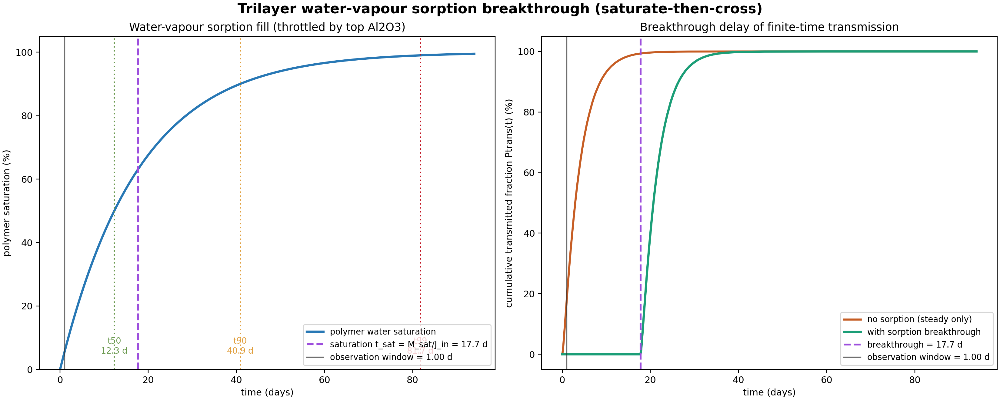
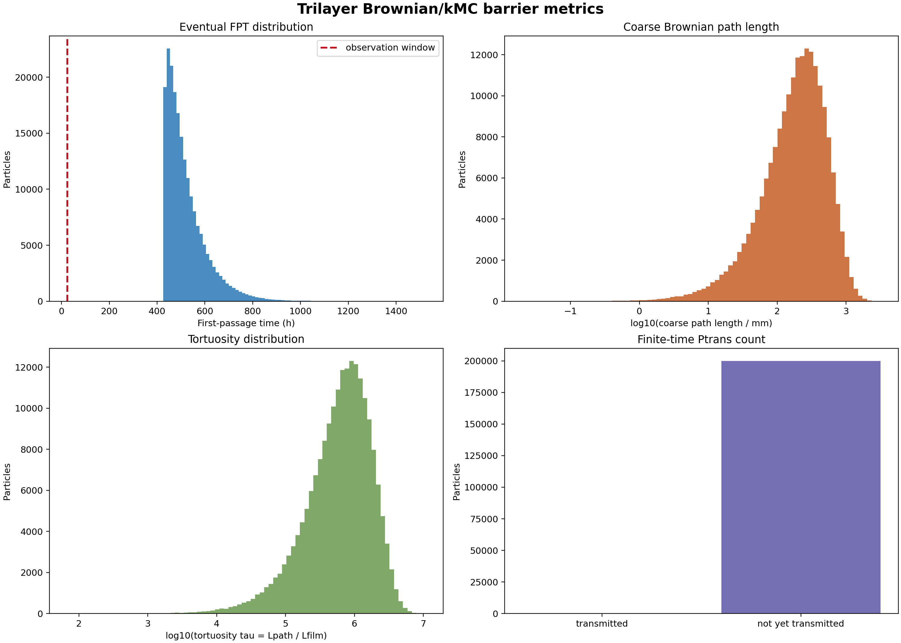

# 三层膜 Brownian/kMC 粗粒化模型

## 文献约束后的建模思想

有机/无机多层阻隔膜的关键不是简单串联厚度，而是有机层把上下无机层缺陷解耦，
使水分子必须在有机层中横向扩散搜索下一个缺陷入口。Al2O3 层本体近似不可渗透，
渗透主要由缺陷控制。

## 本次模型

- 结构: Al2O3 / polymer / Al2O3 = 44 / 208 / 44 nm
- D_Al2O3 = 5.260e-19 m2/s
- D_polymer = 2.000e-13 m2/s
- 缺陷直径 = 1 um
- 缺陷间距 = 100 um
- 路径长度粗粒化步长 = 1 um
- Ptrans 观测窗口 = 86400 s

## 输出（稳态，缺陷控制；不受吸附闸门影响）

- Ptrans(86400 s) = 0.0000  （含吸附击穿闸门）
- Ptrans(86400 s) = 0.1789  （旧模型，无吸附）
- FPT(steady) mean = 3.41e+05 s
- FPT(effective, 含击穿) mean = 1.87e+06 s
- Lpath mean = 270 mm
- tau mean = 9.11e+05
- D_eff(steady) = 1.285e-19 m2/s
- WVTR(steady) = 0.04575 mg m^-2 day^-1

## 溶解度驱动的吸水饱和击穿（水蒸气渗透：先饱和后穿透）

水蒸气分子穿过上层 Al2O3 缺陷后进入高分子层。按本项目设定的顺序机理：**高分子层必须先把
水吸到 Henry 饱和（C_eq = S·p1），其供水受上层 Al2O3 稀疏缺陷的水蒸气进入通量节流；在达到
饱和之前，下层 Al2O3 的穿透尚未开始**（单向充填至满饱和，无"下层放电"）。**该机制只延迟瞬态
（Ptrans(t)），不改变由缺陷控制的稳态 WVTR/D_eff**——这正是高溶解度有机夹层能拉长击穿/滞后
时间却不降低稳态渗透的原因。

- 溶解度系数 S = 1 mol m^-3 Pa^-1
- 工况: T = 38 °C, 上游 RH = 0.9, 下游 RH = 0
- 饱和蒸气压 p_sat = 6630 Pa；上游水分压 p1 = 5967 Pa
- 高分子内平衡溶解浓度 C_eq = S·p1 = 5967 mol m^-3
- 单位面积饱和储水量 M_sat = C_eq·L_poly = 22.36 mg m^-2
- 上层 Al2O3 水蒸气进入通量 J_in = 8.095e-10 mol m^-2 s^-1
- **吸水饱和时间 t_sat = M_sat/J_in = C/W = 1.533e+06 s = 17.7 天**
- 饱和充填特征时间: t50 = 12.3 天, t90 = 40.9 天, t99 = 81.7 天
- 纯扩散时间滞后 L_poly^2/6D = 0.0361 s（可忽略，膜太薄）

**物理结论**: 真正控制饱和的是上层缺陷稀疏的水蒸气进入节流，而非高分子内扩散。
因此吸水饱和击穿约 17.7 天，远大于观测窗 1 天，
使 Ptrans(观测窗) 从 0.1789（无吸附）降至
0.0000（含吸附）；而稳态 WVTR 几乎不变。
注：单向充填随膜内浓度上升、驱动力 (p1-p_poly) 减小而趋缓，sat(t)=1-exp(-t/t_sat) 渐近至满饱和；
"达到饱和才穿过"是其顺序门近似，上面给出 t50/t90/t99 供按阈值取用。

## 解释（稳态阻滞机理）

模型被校准到图中三层膜 WVTR = 0.046 mg m^-2 day^-1。
由此反推出三层膜 D_eff = 1.292e-19 m2/s，平均首次通过时间约
3.39e+05 s。单个 Al2O3 缺陷层的穿越时间尺度仅约 1.84e+03 s，
所以主要阻滞来自 polymer 层中的横向搜索，校准均值约 3.35e+05 s。

缺陷面积分数为 7.854e-05，直接上下对齐的概率很低。
二维窄逃逸估计给出搜索时间约 3.76e+04 s；校准搜索时间更长，
可理解为真实缺陷入口并非理想吸收边界、界面滞留/吸附、路径重复试探和局部堵塞
共同造成的额外惩罚。

## 可视化

### 吸水饱和击穿（先饱和后穿透）

左：溶解度驱动的高分子单向吸水充填曲线 sat(t)=1-exp(-t/t_sat) 及 t50/t90/t99；
右：有限时间累计透过率 Ptrans(t)——含吸水饱和击穿 vs 旧（仅稳态）的对比。

### 指标分布

FPT、粗粒化路径长度、迂曲度分布与有限时间透过计数。
